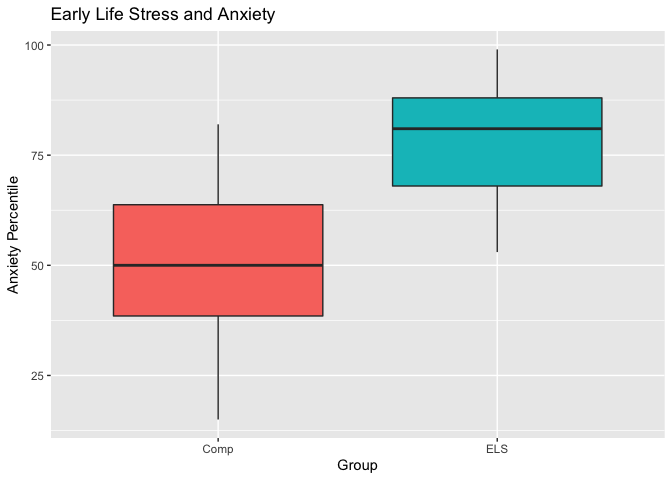

Tutorial - Boxplots and T-tests in R
================
Emily Towner

# Created for the BABLab RA meeting on 4/17/20

First we need to install and load the necessary libraries for this
tutorial

``` r
# Install packages
install.packages("tidyverse")
install.packages("ggplot2")
install.packages("wesanderson")
install.packages("rmarkdown")
```

``` r
# Load libraries
library(tidyverse)
```

    ## ── Attaching packages ─────────────────── tidyverse 1.3.0 ──

    ## ✔ ggplot2 3.2.1     ✔ purrr   0.3.3
    ## ✔ tibble  2.1.3     ✔ dplyr   0.8.3
    ## ✔ tidyr   1.0.0     ✔ stringr 1.4.0
    ## ✔ readr   1.3.1     ✔ forcats 0.4.0

    ## ── Conflicts ────────────────────── tidyverse_conflicts() ──
    ## ✖ dplyr::filter() masks stats::filter()
    ## ✖ dplyr::lag()    masks stats::lag()

``` r
library(ggplot2)
library(wesanderson)
```

The next step is to import our mock dataset. In this dataset we will be
looking at anxiety and depression percentiles between individuals who
did and did not experience early life stress

``` r
# Import dataset
df <- read.csv("data.csv")
```

Next, we want to factor our group and set names for our levels.

``` r
df$group <- as.factor(df$group)

df$group <- factor(df$group,
levels = c(0,1),
labels = c("Comp", "ELS"))
```

Next, let’s have a look at our data\!

``` r
p <- ggplot(df, aes(group, anxiety_percentile, fill = group)) +
        geom_boxplot() + 
        ggtitle("Early Life Stress and Anxiety") + xlab("Group") + ylab("Anxiety Percentile") +
        theme(legend.position = "none")
p
```

<!-- -->

Now let’s add some fun colors - there are a lot of different palettes
and themes available. This one uses color palettes from Wes Anderson
movies. You can find all the options
[here](https://github.com/karthik/wesanderson).

Try a different palette
yourself\!

``` r
p <- p+ scale_fill_manual(values=wes_palette(n=2, name="GrandBudapest2"))
p
```

<!-- -->

That difference looks pretty significant, but let’s do a t-test to test
it

``` r
t.test(anxiety_percentile ~ group, data = df)
```

    ## 
    ##  Welch Two Sample t-test
    ## 
    ## data:  anxiety_percentile by group
    ## t = -8.814, df = 92.465, p-value = 6.88e-14
    ## alternative hypothesis: true difference in means is not equal to 0
    ## 95 percent confidence interval:
    ##  -31.49067 -19.90933
    ## sample estimates:
    ## mean in group Comp  mean in group ELS 
    ##              51.98              77.68

# Now you try with the depression percentile variable
